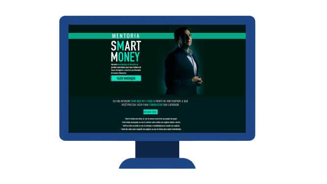

<figure>
  

    
    <figcaption>
      

        SMART MONEY é o título do <a href="https://joaokepler.com.br/smart-money/" target="_blank" rel="noopener noreferrer">livro escrito por João Kepler</a>, do qual também derivou uma mentoria. Esta <strong>L</strong>anding <strong>P</strong>age contém todas as informações sobre a mentoria, suas vantagens, propriedades e preço, e faz parte de um desafio técnico.
      

    </figcaption>
  

</figure>

---

 

  <a href="#boom-demonstração">Demonstração</a>&nbsp;&nbsp;&nbsp;|&nbsp;&nbsp;&nbsp;
  <a href="#books-tecnologias">Tecnologias</a>&nbsp;&nbsp;&nbsp;|&nbsp;&nbsp;&nbsp;
  <a href="#wrench-como-executar">Como executar</a>&nbsp;&nbsp;&nbsp;|&nbsp;&nbsp;&nbsp;
  <a href="#microscope-detalhes-técnicos">Detalhes técnicos</a>

  

## :boom: Demonstração

Você pode navegar pela _Landing Page_ através [deste link](https://joaodos3v.github.io/smart-money-lp/).

## :books: Tecnologias

Visando obter máximo desempenho sem nenhuma depêndencia externa, a página foi construída apenas com HTML e CSS.

- [HTML](https://developer.mozilla.org/pt-BR/docs/Web/HTML)
- [CSS](https://developer.mozilla.org/pt-BR/docs/Web/CSS)

## :wrench: Como executar

Como este projeto contém apenas HTML e CSS, você pode clonar o repositório e abrir o arquivo `index.html` no _browser_ de sua preferência.

> :star: **NOTA:** como dica, utilize o [Live Server](https://marketplace.visualstudio.com/items?itemName=ritwickdey.LiveServer) para abrir seu projeto e visualizar as alterações automaticamente.

## :microscope: Detalhes técnicos

### SEO (Search Engine Optimization)

Já no recebimento do desafio, comentou-se da importância de uma boa indexação desta página nos mecanismos de busca atual. Além disso, tendo em vista que esta _landing page_ objetiva uma **venda**, é importante que todos usuários consigam encontrá-la de forma fácil e que a mesma adapte-se a qualquer dispositivo. Com isso em mente, além de criar uma página **responsiva**, utilizou-se o [Google Lighthouse](https://developers.google.com/web/tools/lighthouse) durante todo o desenvolvimento, buscando seguir as melhores práticas de: _Performance_, _Acessibilidade_, _Boas práticas de código_ e _SEO_.

O resultado atual da página encontra-se na _screenshot_ abaixo:

  

> :star: **NOTA:** um detalhe que pode ser aprimorado é a definição estática dos tamanhos das imagens, passando a "corrigir", de acordo com o dispositivo, via propriedades CSS.

### CSS

Ao longo do desenvolvimento, alguns _"truques"_ foram adotados no arquivo `style.css` para facilitar o desenvolvimento. A lista abaixo contém uma breve descrição sobre cada um deles, além de alguns links com referências - quando necessário.

- **`Linha 45`**: atribuir o `font-size` de uma página, além de tornar o _layout_ mais fluido, melhora a _DX (Developer Experience)_, pois torna `1rem = 10px`. Na prática, isso evita que, ao utilizar - por exemplo - `2.5 rem`, o desenvolvedor precise ficar calculando que `(2rem = 32 px) + (0.5rem = 8px) -> 40px`, permitindo com que ele simplesmente defina `4rem` sempre que precisar que algo ocupe `10px`. Essa é uma prática comum entre desenvolvedores e os _links_ abaixo explicam mais detalhes de suas vantagens (e desvantagens).
  - [Referência 1](https://engageinteractive.co.uk/blog/em-vs-rem-vs-px#:~:text=A%20typical%20method%20is%20to,rem%20would%20now%20equal%2020px.)
  - [Referência 2](https://stackoverflow.com/questions/28988445/css-62-5-why-do-developers-use-it)
- **`Linha 159`**: todas as seções desta _landing page_ possuem uma formatação padrão, inclusive com `padding-top` _default_. Na seção de introdução - que contém a imagem do João Kepler - foi necessário sobrescrever esse padrão de topo para `0`, tendo em vista que a imagem já possui um espaçamento próprio no topo.
- **`Linha 222`**: para alterar a cor dos _bullets_ da lista de cenários, foi necessário criar uma "adaptação" de conteúdo.
  - [Referência](https://www.w3schools.com/howto/howto_css_bullet_color.asp)
- **`Linha 229`**: este, assim como outros lugares da página, utiliza a sintaxe `item + item`. Isto, em CSS, quer dizer que aquele determinado estilo será aplicado em todos os `item` que for precedido por um `item`. Na prática, em uma lista, por exemplo, todos os itens serão afetados, exceto o primeiro (que não possui um elemento precedente especificado e, portanto, não enquadra-se na regra).
- **`Linha 241`**: o termo _'PASSO A PASSO'_ teve que ter sua cor alterada para que o tópico **Acessibilidade** do Lighthouse ficasse _100 :heavy_check_mark:_, uma vez que a plataforma identificou que cor utilizada no protótipo não fornecia o contraste necessário para todos os tipos de leitores.
  - [Referência](https://github.com/joaodos3v/smart-money-lp/blob/documentation/images/Screenshot_1.png)

 

Feito com :dart: por <a href="https://www.linkedin.com/in/joaodos3v/" target="_blank" rel="noopener noreferrer">João Vitor Veronese Vieira</a> :boy:

